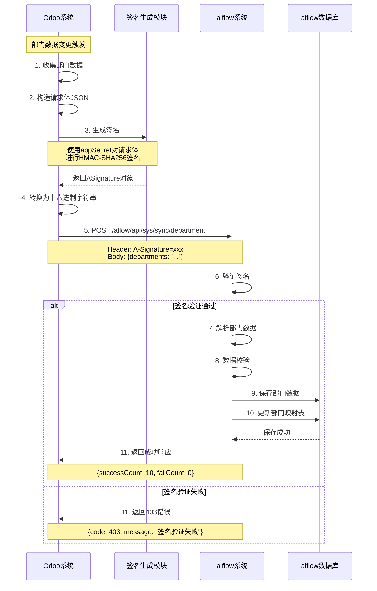
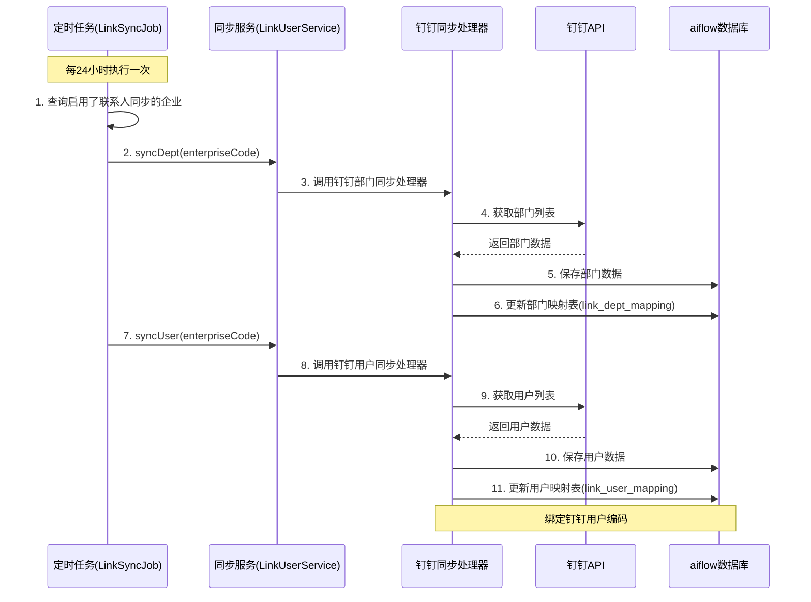
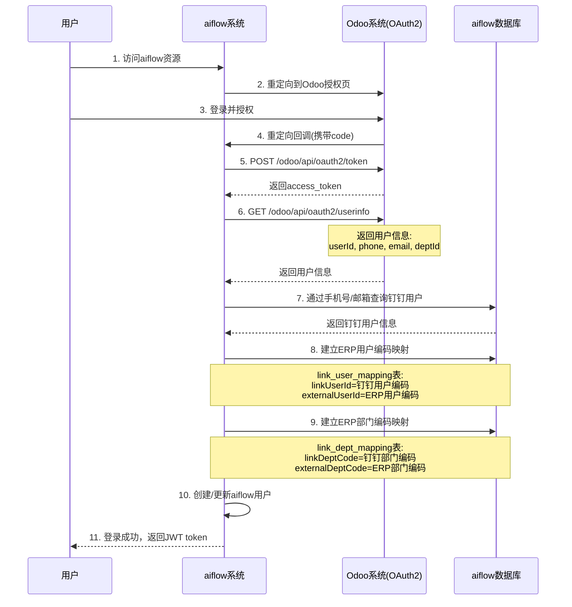
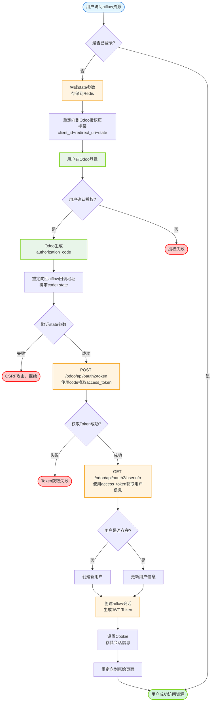
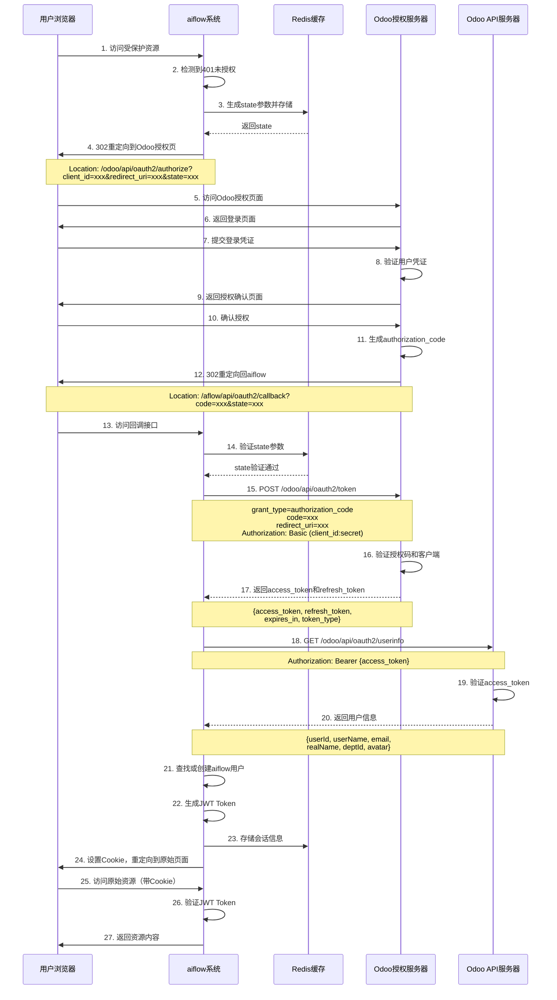
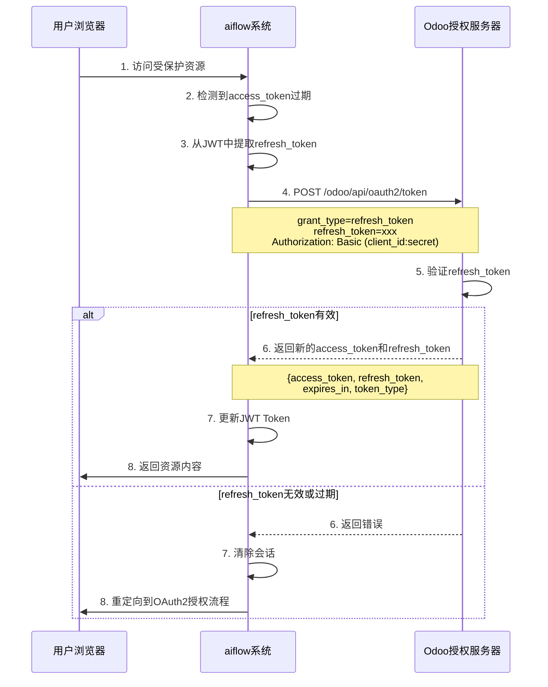
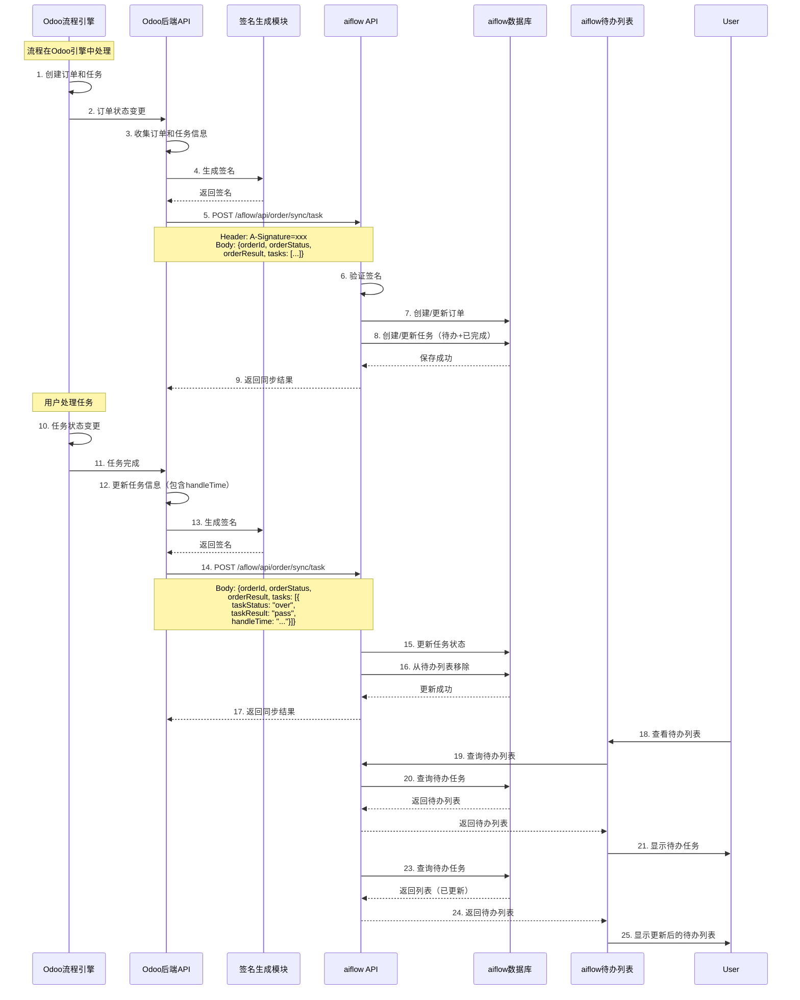
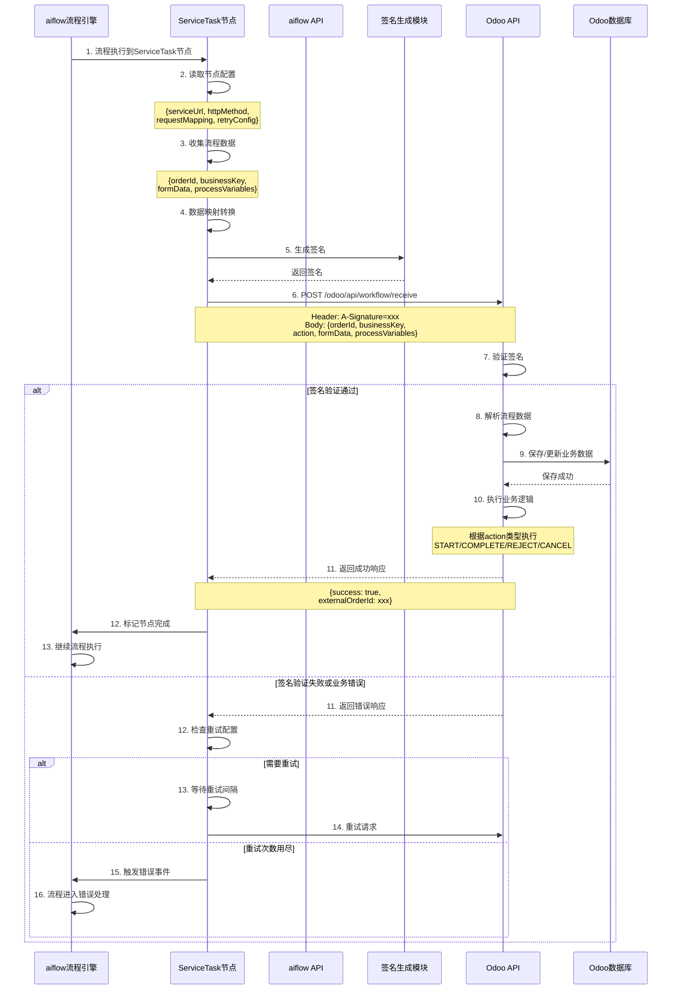

# ERP系统对接aiflow技术原理与接口设计文档

本文档详细说明ERP系统对接aiflow流程中心的技术实现细节、接口设计和数据库设计。

> **返回主方案文档：** [ERP系统对接aiflow流程中心设计方案](erp-wms-integration-design.md)

---

## 基础数据同步方案

> **注意**：基础数据同步有两种方案可选，详见 [主方案文档 - 基础数据同步方案](erp-wms-integration-design.md#21-基础数据同步方案)

---

## 方案一：ERP主动推送方案

### 接口安全设计

#### 签名算法

> **推荐方式**：Odoo 可直接使用 aflow 提供的 **Python SDK**（`aflow-client-python`），无需自行实现签名算法。SDK 已实现完整的签名生成逻辑，确保与 aiflow 服务端完全兼容。

**使用 Python SDK（推荐）：**

```python
from aflow_client_python import ASignature

# 创建认证凭证
credential = dict(
    enterprise_code="COMPANY001",
    app_id="APP001",
    app_secret="your_app_secret"
)

# 生成签名
request_data = {"departments": [...]}
# dump的时候，不要使用 ensure_ascii=False
request_body = json.dumps(request_data)

sig_generator = ASignature()
signature = sig_generator.create_signature(request_body, credential)
# 如果credential中的变量已经注入到系统变量中，可以通过
    # os.getenv("APP_ID") 来获取app_id
    # os.getenv("ENTERPRISE_CODE") 来获取enterprise_code
    # os.getenv("APP_SECRET") 来app_secret
# 那么创建签名对象时，不需要再传入credential
# signature = sig_generator.create_signature(request_body)

# 设置请求头
headers = {
    "Content-Type": "application/json",
    "X-A-Signature": signature
}
```

**SDK 获取和安装：**
- SDK 位置：`aflow-client-python` 项目
- 安装方式：`pip install -e .` 或 `pip install aflow-client`
- 详细文档：参考 SDK 项目中的 `README.md`

---

**自行实现签名算法（不推荐，仅作参考）：**

参考aiflow现有的签名验证机制（`com.aflow.client.open.bean.auth.ASign#getHexSignature`），实际使用的是 MD5 算法（不是 HMAC-SHA256）。

**签名生成步骤：**

1. 构造签名对象（ASignature）：
   ```json
   {
     "enterpriseCode": "企业编码",
     "appId": "应用ID",
     "timestamp": 时间戳（毫秒）,
     "cipher": "签名密文"
   }
   ```

2. 签名计算：
   - 构造字符串：`enterpriseCode + appSecret + requestBody + timestamp`
   - 第一次 MD5：`MD5(enterpriseCode + appSecret + requestBody + timestamp)`
   - 第二次 MD5：`MD5(第一次MD5的结果)`
   - 将ASignature对象序列化为JSON，再转换为十六进制字符串

3. 请求头设置：
   - Header名称：`A-Signature`
   - Header值：ASignature对象的十六进制编码字符串

**签名验证流程：**

1. aiflow接收请求，从Header中获取`A-Signature`
2. 将十六进制字符串解码为JSON，反序列化为ASignature对象
3. 根据enterpriseCode和appId查询对应的appSecret
4. 使用相同的算法重新计算签名
5. 比较计算出的签名与请求中的签名是否一致

#### 安全配置

- **AppId/AppSecret管理**：在aiflow系统中为每个对接企业配置唯一的AppId和AppSecret
- **时间戳验证**：验证请求时间戳，防止重放攻击（建议时间窗口：±5分钟）
- **HTTPS传输**：所有接口必须使用HTTPS协议传输

### 部门数据同步接口

> **详细接口定义请参考：** [技术详细设计文档 - 部门数据同步接口](integration-technical-design.md#211-部门数据同步接口)

#### 部门数据同步时序图

> **注意**：以下时序图使用Mermaid语法绘制。



#### 业务逻辑

1. **部门映射**：aiflow系统维护部门映射表（`link_dept_mapping`），建立外部部门ID与aiflow部门编码的映射关系
2. **增量同步**：支持全量推送和增量推送
3. **层级关系**：自动处理部门层级关系，确保父部门先于子部门创建
4. **数据校验**：
   - 必填字段：deptId, deptName
   - 部门ID唯一性校验
   - 父部门存在性校验

### 用户数据同步接口

> **详细接口定义请参考：** [技术详细设计文档 - 用户数据同步接口](integration-technical-design.md#212-用户数据同步接口)

#### 业务逻辑

1. **用户映射**：aiflow系统维护用户映射表（`link_user_mapping`），建立外部用户ID与aiflow用户编码的映射关系
2. **部门关联**：用户必须关联到已存在的部门
3. **用户状态**：支持启用/禁用状态同步
4. **批量处理**：支持批量同步用户数据
5. **人员类型**：支持人员类型字段（personnelType），包括正式、实习、外包、劳务、顾问等类型
6. **直接上级**：支持直接上级字段（directSupervisor），用于建立上下级关系（最大Boss可为空）
7. **层级顺序**：**重要**：接口传递数据必须按层级顺序传递（一级、二级、三级...一直到最低级），否则直接传下级数据时，aiflow上级没有生成，会保存出错

#### 人员类型说明

| 值 | 类型 | 说明 |
|----|------|------|
| 1 | 正式 | 正式员工 |
| 2 | 实习 | 实习员工 |
| 3 | 外包 | 外包员工 |
| 4 | 劳务 | 劳务员工 |
| 5 | 顾问 | 顾问 |

#### 数据传递顺序要求

**正确示例：**
```json
{
  "users": [
    {"userId": "U001", "userName": "CEO", "deptId": "D001", "directSupervisor": null},      // 一级：CEO
    {"userId": "U002", "userName": "VP1", "deptId": "D002", "directSupervisor": "U001"},    // 二级：VP1（上级是CEO）
    {"userId": "U003", "userName": "VP2", "deptId": "D003", "directSupervisor": "U001"},    // 二级：VP2（上级是CEO）
    {"userId": "U004", "userName": "M1", "deptId": "D004", "directSupervisor": "U002"},     // 三级：M1（上级是VP1）
    {"userId": "U005", "userName": "E1", "deptId": "D005", "directSupervisor": "U004"}      // 四级：E1（上级是M1）
  ]
}
```

**错误示例（会导致保存失败）：**
```json
{
  "users": [
    {"userId": "U005", "userName": "E1", "deptId": "D005", "directSupervisor": "U004"},    // 错误：先传下级
    {"userId": "U004", "userName": "M1", "deptId": "D004", "directSupervisor": "U002"}       // 错误：上级U004还未创建
  ]
}
```

#### 方案一：钉钉登录时用户绑定

**绑定流程：**
1. ERP推送用户数据到aiflow（包含手机号）
2. 用户在钉钉小程序中登录aiflow
3. aiflow通过钉钉token获取用户手机号
4. 通过手机号匹配，绑定钉钉用户编码和ERP用户编码

**实现要点：**
- 需要在钉钉登录处理逻辑中（如`DingUserHandle`）增加手机号匹配逻辑
- 通过手机号查询`link_user_mapping`表，找到对应的ERP用户编码
- 建立钉钉用户编码与ERP用户编码的映射关系

---

## 方案二：aiflow主动同步钉钉方案（推荐）

### 方案概述

方案二采用aiflow主动从钉钉同步数据的方式，复用现有的钉钉同步机制，无需开发ERP推送接口。

**核心优势：**
- 复用现有机制：使用`DingDingUserSyncHandle`和`DingDingDeptSyncHandler`
- 减少对接工作量：ERP无需开发推送接口
- 统一数据源：以钉钉为统一的数据源
- 绑定时机清晰：钉钉同步时绑定钉钉关系，SSO登录时绑定ERP关系

### 钉钉同步定时任务

aiflow已有完整的钉钉同步定时任务实现（`LinkSyncJob`），配置为每24小时执行一次。

**定时任务配置：**
- **任务类**：`com.aflow.sys.quartz.LinkSyncJob`
- **执行频率**：每24小时执行一次
- **同步内容**：部门和用户数据
- **同步方向**：钉钉 → aiflow

**同步流程：**
1. 定时任务触发（`LinkSyncJob.executeInternal`）
2. 查询所有启用了联系人同步的企业（`LinkDirectionEnum.TRIPARTITE_VALIDATION`）
3. 对每个企业执行部门同步（`syncDept`）和用户同步（`syncUser`）
4. 使用`DingDingDeptSyncHandler`同步部门数据
5. 使用`DingDingUserSyncHandle`同步用户数据
6. 自动建立钉钉用户编码与aiflow用户编码的映射关系（存储在`link_user_mapping`表）

#### 钉钉同步时序图



### SSO登录用户绑定逻辑

在SSO登录流程中，需要增加ERP用户编码和部门编码的绑定逻辑。

**绑定时机：** OAuth2流程中获取用户信息后（`/odoo/api/oauth2/userinfo`）

**绑定流程：**
1. 用户通过SSO登录aiflow（OAuth2流程）
2. aiflow调用`/odoo/api/oauth2/userinfo`获取ERP用户信息
3. ERP返回用户信息（包含手机号、邮箱、部门ID等）
4. aiflow通过手机号或邮箱匹配钉钉用户
5. 建立ERP用户编码与钉钉用户编码的映射关系
6. 建立ERP部门编码与aiflow部门编码的映射关系

#### SSO登录用户绑定时序图



### 实现要点

#### 1. OAuth2 UserInfo接口要求

Odoo提供的`/odoo/api/oauth2/userinfo`接口必须返回以下字段：

```json
{
  "userId": "ERP用户ID",
  "username": "用户名",
  "phone": "手机号",
  "email": "邮箱",
  "deptId": "部门ID",
  "deptName": "部门名称",
  "name": "姓名"
}
```

**必填字段：**
- `userId`：ERP用户ID（用于建立映射关系）
- `phone`或`email`：至少提供一个，用于匹配钉钉用户
- `deptId`：部门ID（用于建立部门映射关系）

#### 2. 用户绑定实现

在OAuth2回调处理逻辑中（如`OAuth2CallbackController`），增加用户绑定逻辑：

```java
// 伪代码示例
public void handleOAuth2Callback(String code) {
    // 1. 获取access_token
    TokenResponse token = exchangeCodeForToken(code);
    
    // 2. 获取用户信息
    UserInfoResponse userInfo = getUserInfo(token.getAccessToken());
    
    // 3. 通过手机号/邮箱匹配钉钉用户
    LinkUserMapping dingUser = linkUserService.findByPhoneOrEmail(
        userInfo.getPhone(), 
        userInfo.getEmail()
    );
    
    if (dingUser != null) {
        // 4. 建立ERP用户编码映射
        linkUserService.createOrUpdateMapping(
            dingUser.getLinkUserId(),  // 钉钉用户编码
            userInfo.getUserId(),      // ERP用户编码
            "odoo"                      // 外部系统类型
        );
        
        // 5. 建立部门编码映射
        linkDeptService.createOrUpdateMapping(
            dingUser.getDeptCode(),    // 钉钉部门编码
            userInfo.getDeptId(),      // ERP部门编码
            "odoo"
        );
    }
    
    // 6. 创建/更新aiflow用户并返回JWT
    // ...
}
```

#### 3. 数据库映射表

方案二使用现有的映射表，无需新增表结构：

- **`link_user_mapping`**：用户映射表
  - `link_user_id`：钉钉用户编码
  - `external_user_id`：ERP用户编码
  - `link_enterprise_type`：外部系统类型（如"odoo"）

- **`link_dept_mapping`**：部门映射表
  - `link_dept_code`：钉钉部门编码
  - `external_dept_code`：ERP部门编码
  - `link_enterprise_type`：外部系统类型

### 方案二优势总结

1. **开发工作量小**：aiflow复用现有钉钉同步机制，ERP无需开发推送接口
2. **数据一致性高**：以钉钉为统一数据源，避免多数据源冲突
3. **维护成本低**：只需维护一套同步机制
4. **扩展性好**：未来对接其他系统时，只需在SSO登录时绑定即可

---

## SSO单点登录对接方案（OAuth 2.0）

### OAuth 2.0授权码流程

采用标准的OAuth 2.0授权码（Authorization Code）流程，确保安全性。

#### OAuth2原理图

OAuth 2.0授权码流程涉及三个主要角色：用户（Resource Owner）、aiflow系统（Client）、Odoo系统（Authorization Server & Resource Server）。

> **注意**：以下图表使用Mermaid语法绘制，需要在支持Mermaid的Markdown查看器中查看（如GitHub、GitLab、VS Code的Markdown Preview Enhanced插件等）。



#### OAuth2接口调用时序图

详细的接口调用时序图展示了aiflow和Odoo之间的完整交互过程：

> **注意**：以下时序图使用Mermaid语法绘制。



#### Token刷新时序图

当access_token过期时，使用refresh_token刷新Token的流程：

> **注意**：以下时序图使用Mermaid语法绘制。



### Odoo需要提供的接口标准

> **详细接口定义请参考：** [技术详细设计文档 - SSO单点登录对接方案](integration-technical-design.md#3-sso单点登录对接方案)

### aiflow系统改动方案

#### 配置管理

aiflow支持私有化部署，通过配置文件控制是否启用SSO登录。

**配置文件：** `application-prod.yml`、`application-dev.yml`、`application-local.yml`

**配置项：**
```yaml
custom:
  sso:
    enabled: true                    # 是否启用SSO登录（默认false）
    redirectUri: "https://odoo.example.com/odoo/api/oauth2/authorize"  # 客户登录页地址（启用SSO时必填）
```

**配置说明：**
- `custom.sso.enabled`：是否启用SSO登录
  - `true`：启用SSO，401时跳转到客户登录页
  - `false`：使用aiflow默认登录页（`https://beta.aiflow.fan/login`）
- `custom.sso.redirectUri`：客户登录页地址（Odoo授权端点地址）
  - 启用SSO时必填
  - 格式：`https://odoo.example.com/odoo/api/oauth2/authorize`

**测试支持：**
- 为了测试SSO登录功能，aiflow项目工程中需要模拟实现一个Odoo登录页
- 模拟登录页需要实现OAuth2授权端点功能，完成整个功能的闭环测试

**数据库配置（可选）：**
在aiflow系统中也可以新增OAuth2配置表，存储每个企业的OAuth2配置信息（用于多租户场景）：

**配置项：**
- `enterprise_code`: 企业编码
- `oauth2_provider`: OAuth2提供商（如：odoo）
- `client_id`: 客户端ID
- `client_secret`: 客户端密钥（加密存储）
- `authorization_url`: 授权端点URL
- `token_url`: 令牌端点URL
- `userinfo_url`: 用户信息端点URL
- `redirect_uri`: 回调地址
- `scope`: 授权范围

#### 认证拦截器改造

**改造点：** `com.aflow.app.interceptor.UserInterceptor`

**改造逻辑：**

1. 检测到401未授权错误时，检查SSO配置（`custom.sso.enabled`）
2. 如果启用SSO（`custom.sso.enabled = true`），生成state参数（存储到Redis，设置过期时间5分钟）
3. 重定向到客户登录页（`custom.sso.redirectUri`）
4. 如果未启用SSO，重定向到aiflow默认登录页（`https://beta.aiflow.fan/login`）
5. 用户完成Odoo认证后，Odoo重定向回aiflow的回调地址

#### OAuth2回调处理器

**新增接口：** `GET /aflow/api/oauth2/callback`

**处理流程：**

1. 验证state参数（防止CSRF攻击）
2. 使用授权码换取access_token
3. 使用access_token获取用户信息
4. 根据用户信息查找或创建aiflow用户
5. 创建aiflow会话（JWT Token）
6. 重定向到原始请求页面

#### Token刷新机制

**实现方案：**

1. 在JWT Token中存储refresh_token
2. 当access_token过期时，自动使用refresh_token刷新
3. 刷新失败时，重新发起OAuth2授权流程

#### 代码结构

```
aflow-sys/
  ├── oauth2/
  │   ├── config/
  │   │   └── OAuth2Config.java          # OAuth2配置实体
  │   ├── service/
  │   │   ├── OAuth2Service.java          # OAuth2服务接口
  │   │   └── OAuth2ServiceImpl.java     # OAuth2服务实现
  │   ├── client/
  │   │   └── OAuth2Client.java           # OAuth2客户端（调用Odoo接口）
  │   └── controller/
  │       └── OAuth2Controller.java      # OAuth2回调控制器
  └── interceptor/
      └── UserInterceptor.java            # 改造认证拦截器
```

---

## 任务中心统一简易集成方案

### 流程定义改造

#### 流程引擎类型扩展

在流程定义中新增流程引擎类型字段：

**流程引擎类型枚举：**
- `AFLOW`: aiflow流程引擎（默认）
- `THIRD_PARTY`: 第三方流程引擎（如Odoo）

#### 第三方引擎配置

当流程引擎类型为`THIRD_PARTY`时，需要配置以下信息：

**配置项：**
- `flowCode`: 流程编码
- `engineType`: 引擎类型（THIRD_PARTY）
- `initiateUrl`: 流程发起页地址
  - `h5Url`: H5端发起页地址
  - `webUrl`: PC端发起页地址
- `detailUrl`: 订单详情页地址
  - `h5Url`: H5端详情页地址
  - `webUrl`: PC端详情页地址
- `thirdFlowCode`: 外部系统流程编码（必填，全局唯一）

### 创建三方流程定义接口

> **详细接口定义请参考：** [技术详细设计文档 - 创建三方流程定义接口](integration-technical-design.md#41-创建三方流程定义接口)

**接口说明：**
- 三方流程定义是一个特殊的流程定义，定义非常简单
- 需要配置流程基本信息、发起页地址、详情页地址、权限配置等
- 支持版本管理，每个版本需要上线操作

**关键字段：**
- `flowCode`: 三方业务流程编码
- `initiateUrl`: 流程发起页地址（H5+PC）
- `detailUrl`: 订单详情页地址（H5+PC）
- `groupId`: 所属分组（必填）
- `managerUserCode`: 流程负责人（必填）
- `operationUserCode`: 运营负责人（必填）
- `configUserCode`: 配置负责人（必填）
- `createBy`: 创建人（必填）
- `allowedApplyTerminals`: 允许发起终端（可选，默认全部），对应 `FlowDetail.allowedApplyTerminals`
- `allowedApplyRule`: 允许发起规则（可选，默认全部），对应 `FlowDetail.allowedApplyRule`
- `allowedCallRule`: 允许调用规则（可选，默认全部），对应 `FlowDetail.allowedCallRule`
- `allowedManageRule`: 允许查看订单/管理流程规则（可选，默认全部），对应 `FlowDetail.allowedManageRule`

### 三方流程定义上线接口

> **详细接口定义请参考：** [技术详细设计文档 - 三方流程定义上线接口](integration-technical-design.md#42-三方流程定义上线接口)

**接口说明：**
- 三方流程支持按版本管理，每个版本需要上线操作
- 调用 `com.aflow.base.controller.FlowDefinitionController#online` 操作上线
- 需要实现三方流程专用的校验器（`FlowCheckProcessor`），只校验接口中传递的数据，不需要正常流程那么复杂的校验

**实现要点：**
- 需要实现两个 `FlowCheckProcessor`：
  - 一个用于三方流程（简化校验）
  - 一个用于正常流程（完整校验）
- 三方流程校验器只需要校验接口中传递的数据即可

### 任务同步接口

> **详细接口定义请参考：** [技术详细设计文档 - 任务同步接口](integration-technical-design.md#43-任务同步接口)

**接口说明：**
- 三方流程实际是在三方引擎系统中处理
- 业务引擎系统实时将整个订单的结果同步过来，包括待办任务和已完成任务
- 接口名称从"同步待办任务接口"更名为"任务同步接口"
- 接口路径：`POST /aflow/api/order/sync/task`

**新任务通知功能：**
- 当同步的任务是新增任务（`taskStatus` 为 `new` 或 `ing` 状态）时，aiflow会自动发送钉钉push消息通知处理人
- 使用 `com.aflow.sys.link.LinkMsgService#sendFlowMsg` 方法发送通知
- 通知消息会发送给任务的所有处理人（`assigneeUserCode` 列表中的所有用户）
- 消息内容包含任务名称、流程标题、处理按钮等，支持钉钉、飞书、企业微信等多种消息渠道

**关键字段：**
- `orderId`: 流程订单号（必填）
- `orderStatus`: 订单状态（必填）：new-新建，ing-处理中，over-完成
- `orderResult`: 订单结果（必填）：ing-处理中，pass-已完成，reject-已拒绝，revoke-已撤销，delete-已删除
- `initiator`: 发起人编号（必填）
- `version`: 订单版本（可选，有就传，没有可以不传）
- `parentOrderId`: 父订单号（可选，有就传，没有可以不传）
- `parentTaskOrderId`: 父任务订单号（可选，有就传，没有可以不传）
- `businessKey`: 业务编码（必填），用于记录三方系统跟流程引擎对接的唯一映射Key
- `createTime`: 流程订单创建时间（必填，格式：yyyy-MM-dd HH:mm:ss）
- `updateTime`: 流程订单更新时间（必填，格式：yyyy-MM-dd HH:mm:ss）
- `ccUsers`: 抄送人列表（可选，非必传，有就传，没有就不传）
  - `userCode`: 抄送人编码
  - `ccTime`: 抄送时间（格式：yyyy-MM-dd HH:mm:ss）
- `tasks`: 任务列表（包含待办和已完成任务）
  - `taskStatus`: 任务状态（必填）：new-新建，ing-处理中，over-完成
  - `taskResult`: 任务处理结果（必填）：new-新建，accept-领取，pass-通过，reject-拒绝，revoke-撤销，rebut-驳回
  - `assigneeUserCode`: 处理人编码列表（必填，数组类型，可能有多个）
  - `deadLine`: 处理截止时间（必填）
  - `nodeType`: 节点类型（必填）：handle-执行，audit-审批，notify-知悉
  - `handleTime`: 处理时间（可选，处理完成后必填）
  - `showPc`: PC是否展示（必填）
  - `showMobile`: 手机是否展示（必填）

#### 任务同步时序图

> **注意**：以下时序图使用Mermaid语法绘制。



---

## 全面使用流程中心的表单与流程引擎方案

### 流程定义管理接口

> **详细接口定义请参考：** [技术详细设计文档 - 流程定义管理接口](integration-technical-design.md#51-流程定义管理接口)

**业务逻辑：**
1. 验证流程定义的完整性
2. 部署BPMN流程定义到流程引擎
3. 将流程状态设置为"已发布"
4. 如果存在旧版本，将旧版本设置为"已下线"

### 表单同步方案

#### Odoo表单自动同步到aiflow

**实现方式：**

1. **Webhook机制**：Odoo在表单变更时，调用aiflow的表单同步接口

> **详细接口定义请参考：** [技术详细设计文档 - 表单同步接口](integration-technical-design.md#52-表单同步接口)

2. **定时同步**：aiflow定时调用Odoo的表单查询接口，拉取最新表单定义

> **详细接口定义请参考：** [技术详细设计文档 - Odoo需要提供的接口](integration-technical-design.md#54-odoo需要提供的接口)

### ServiceTask数据推送

#### ServiceTask数据推送时序图

> **注意**：以下时序图使用Mermaid语法绘制。



#### 数据推送接口（Odoo需要提供）

> **详细接口定义请参考：** [技术详细设计文档 - 接收流程数据接口](integration-technical-design.md#541-接收流程数据接口)

### 审批日志回传接口（Odoo需要提供）

> **详细接口定义请参考：** [技术详细设计文档 - 接收审批日志接口](integration-technical-design.md#542-接收审批日志接口可选)

---

## 技术实现细节

### 签名算法实现

#### 签名生成（客户端）

```java
public class ASign {
    /**
     * 生成签名
     * @param credential 凭证信息（appId, appSecret, enterpriseCode）
     * @param requestBody 请求体
     * @param timestamp 时间戳（可选，不传则使用当前时间）
     * @return ASignature签名对象
     */
    public static ASignature getSignature(Credential credential, String requestBody, Long timestamp) {
        // 1. 构造待签名字符串
        String signString = requestBody;
        
        // 2. 使用HMAC-SHA256计算签名
        String cipher = hmacSha256(credential.getAppSecret(), signString);
        
        // 3. 构造签名对象
        ASignature signature = new ASignature();
        signature.setEnterpriseCode(credential.getEnterpriseCode());
        signature.setAppId(credential.getAppId());
        signature.setTimestamp(timestamp != null ? timestamp : System.currentTimeMillis());
        signature.setCipher(cipher);
        
        return signature;
    }
    
    /**
     * 将ASignature对象转换为十六进制字符串
     */
    public static String toHexString(ASignature signature) {
        String json = JsonUtil.toJson(signature);
        return bytesToHex(json.getBytes(StandardCharsets.UTF_8));
    }
    
    /**
     * 将十六进制字符串转换为ASignature对象
     */
    public static String hexToString(String hexString) {
        byte[] bytes = hexToBytes(hexString);
        return new String(bytes, StandardCharsets.UTF_8);
    }
    
    private static String hmacSha256(String secret, String data) {
        // HMAC-SHA256实现
    }
}
```

#### 签名验证（服务端）

参考 `com.aflow.sys.aop.AuthSignatureAspect` 的实现。

### 数据库设计

#### 流程定义扩展表

```sql
-- 流程定义表扩展字段
ALTER TABLE flow_base ADD COLUMN engine_type VARCHAR(20) DEFAULT 'AFLOW' COMMENT '流程引擎类型';
ALTER TABLE flow_base ADD COLUMN third_flow_code VARCHAR(50) COMMENT '外部系统流程编码（必填，全局唯一）';
ALTER TABLE flow_base ADD COLUMN initiate_h5_url VARCHAR(500) COMMENT 'H5发起页地址';
ALTER TABLE flow_base ADD COLUMN initiate_web_url VARCHAR(500) COMMENT 'PC发起页地址';
ALTER TABLE flow_base ADD COLUMN detail_h5_url VARCHAR(500) COMMENT 'H5详情页地址';
ALTER TABLE flow_base ADD COLUMN detail_web_url VARCHAR(500) COMMENT 'PC详情页地址';
```

#### OAuth2配置表

```sql
CREATE TABLE qf_oauth2_config (
    id BIGINT AUTO_INCREMENT PRIMARY KEY,
    enterprise_code VARCHAR(50) NOT NULL COMMENT '企业编码',
    oauth2_provider VARCHAR(50) NOT NULL COMMENT 'OAuth2提供商',
    client_id VARCHAR(100) NOT NULL COMMENT '客户端ID',
    client_secret VARCHAR(500) NOT NULL COMMENT '客户端密钥（加密）',
    authorization_url VARCHAR(500) NOT NULL COMMENT '授权端点URL',
    token_url VARCHAR(500) NOT NULL COMMENT '令牌端点URL',
    userinfo_url VARCHAR(500) NOT NULL COMMENT '用户信息端点URL',
    redirect_uri VARCHAR(500) NOT NULL COMMENT '回调地址',
    scope VARCHAR(200) COMMENT '授权范围',
    state VARCHAR(100) COMMENT '状态参数（临时）',
    created_time TIMESTAMP DEFAULT CURRENT_TIMESTAMP,
    updated_time TIMESTAMP DEFAULT CURRENT_TIMESTAMP ON UPDATE CURRENT_TIMESTAMP,
    UNIQUE KEY uk_enterprise_provider (enterprise_code, oauth2_provider)
) COMMENT 'OAuth2配置表';
```

#### 第三方任务表

```sql
CREATE TABLE qf_third_party_task (
    id BIGINT AUTO_INCREMENT PRIMARY KEY,
    order_id BIGINT NOT NULL COMMENT '流程订单ID',
    business_key VARCHAR(100) NOT NULL COMMENT '业务单据号',
    external_task_id VARCHAR(100) NOT NULL COMMENT '外部系统任务ID',
    task_name VARCHAR(200) COMMENT '任务名称',
    assignee_user_code VARCHAR(50) COMMENT '处理人编码',
    task_status VARCHAR(20) NOT NULL COMMENT '任务状态',
    create_time TIMESTAMP DEFAULT CURRENT_TIMESTAMP,
    update_time TIMESTAMP DEFAULT CURRENT_TIMESTAMP ON UPDATE CURRENT_TIMESTAMP,
    INDEX idx_order_id (order_id),
    INDEX idx_business_key (business_key),
    INDEX idx_external_task_id (external_task_id),
    INDEX idx_assignee (assignee_user_code, task_status)
) COMMENT '第三方任务表';
```

### 接口实现示例

#### 部门同步接口实现

```java
@RestController
@RequestMapping("/aflow/api/sys/sync")
public class SyncOpenApiController {
    
    @AuthSignature
    @PostMapping("/department")
    public JsonResult<SyncResult> syncDepartment(@RequestBody DepartmentSyncRequest request) {
        // 1. 参数校验
        // 2. 批量处理部门数据
        // 3. 返回处理结果
    }
}
```

#### OAuth2回调处理

```java
@RestController
@RequestMapping("/aflow/api/oauth2")
public class OAuth2Controller {
    
    @GetMapping("/callback")
    public ResponseEntity<Void> callback(
            @RequestParam String code,
            @RequestParam String state) {
        // 1. 验证state
        // 2. 换取access_token
        // 3. 获取用户信息
        // 4. 创建aiflow会话
        // 5. 重定向到原始页面
    }
}
```

### 错误处理

#### 错误码定义

> **状态码规则：** 使用 `StatusCodeEnum` 枚举，成功为 `0`，错误为负数。

| 状态码 | 错误信息 | 说明 |
|--------|---------|------|
| 0 | SUCCESS | 成功 |
| -4002 | PARAM_ERROR | 参数错误 |
| -4001 | NOT_SUPPORT | 操作不支持 |
| -1024 | ERROR | 通用错误 |

#### 错误响应格式

```json
{
  "status": -4002,
  "msg": "请求参数错误",
  "data": {
    "errorCode": "INVALID_PARAMETER",
    "errorMessage": "部门ID不能为空",
    "errorDetails": [
      {
        "field": "departments[0].deptId",
        "message": "不能为空"
      }
    ]
  }
}
```

> **注意：** 状态码使用 `StatusCodeEnum` 枚举：
> - `0`：成功（`StatusCodeEnum.SUCCESS`）
> - `-4002`：参数错误（`StatusCodeEnum.PARAM_ERROR`）
> - `-1024`：通用错误（`StatusCodeEnum.ERROR`）
> - `-4001`：操作不支持（`StatusCodeEnum.NOT_SUPPORT`）

---

## 接口清单

> **完整的接口定义和参数说明请参考：** [技术详细设计文档](integration-technical-design.md)

### aiflow方需要提供的接口（12个）

| 接口路径 | 方法 | 功能 | 阶段 |
|---------|------|------|------|
| `/aflow/api/sys/sync/department` | POST | 部门同步 | 阶段一 |
| `/aflow/api/sys/sync/user` | POST | 用户同步 | 阶段一 |
| `/aflow/api/oauth2/callback` | GET | OAuth2回调 | 阶段二 |
| `/aflow/api/oauth2/refresh` | POST | Token刷新 | 阶段二 |
| `/aflow/api/flow/create_third_party` | POST | 创建三方流程定义 | 阶段三 |
| `/aflow/api/flow/online_third_party` | POST | 三方流程定义上线 | 阶段三 |
| `/aflow/api/order/sync/task` | POST | 任务同步（支持完整订单状态和任务信息） | 阶段三 |
| `/aflow/api/flow/create` | POST | 创建流程定义 | 阶段四 |
| `/aflow/api/flow/update` | PUT | 更新流程定义 | 阶段四 |
| `/aflow/api/flow/publish` | POST | 发布流程 | 阶段四 |
| `/aflow/api/form/sync` | POST | 表单同步 | 阶段四 |
| `/aflow/api/order/approval/log` | POST | 审批日志 | 阶段四 |

### Odoo方需要提供的接口（6个）

| 接口路径 | 方法 | 功能 | 阶段 |
|---------|------|------|------|
| `/odoo/api/oauth2/authorize` | GET | OAuth2授权端点 | 阶段二 |
| `/odoo/api/oauth2/token` | POST | OAuth2令牌端点 | 阶段二 |
| `/odoo/api/oauth2/userinfo` | GET | OAuth2用户信息 | 阶段二 |
| `/odoo/api/form/list` | GET | 查询表单列表（可选） | 阶段四 |
| `/odoo/api/workflow/receive` | POST | 接收流程数据 | 阶段四 |
| `/odoo/api/workflow/approval/log` | POST | 接收审批日志（可选） | 阶段四 |

---

## 参考资料

- OAuth 2.0规范：https://oauth.net/2/
- BPMN 2.0规范：https://www.omg.org/spec/BPMN/2.0/
- aiflow现有签名机制：`com.aflow.client.open.bean.auth.ASign`

---

## 相关文档

- **[主方案文档](erp-wms-integration-design.md)** - 整体方案概述
- **[技术详细设计文档](integration-technical-design.md)** - 完整的接口定义和参数说明
- **[任务计划文档](./integration-task-checklist.md)** - 双方任务清单
